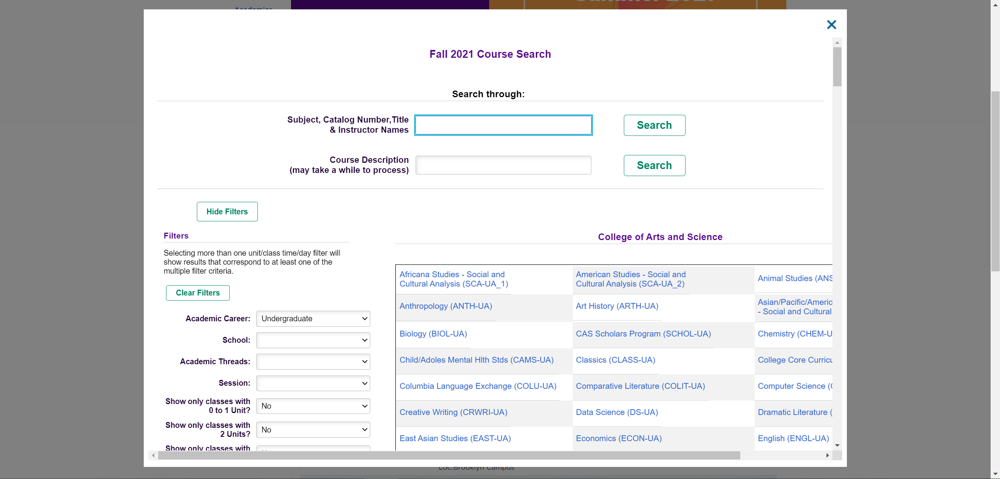
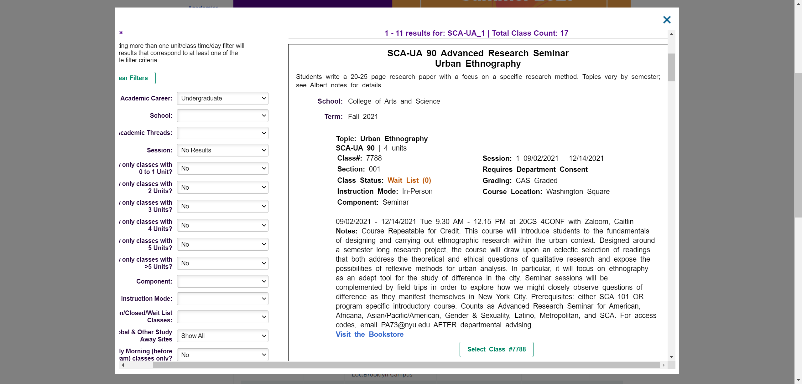
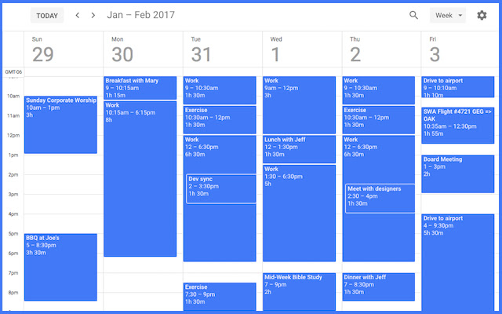

# AlbertWrapper

## Initial Authors:

Jerry Wu & Jeremy Chen

## Project description:

This project is intend for a better class selection experience for NYU Albert.  **This project is not affiliated with NYU. If it violates any rules please contact us and we will delete it immediately.** The idea now is to either build a wrapper for Albert class selection interface or use web crawling (if allowed)  to get class info from Albert and incorporate into a new website.

## Why Need This?

This is what Albert class selection interface currently look like (image from screenshot):

and we are trying to make it look more like a Google Calendar style (image from [here](https://chrome.google.com/webstore/detail/event-durations-for-googl/elfoibhncineionfonglaickdliaikmj)):

